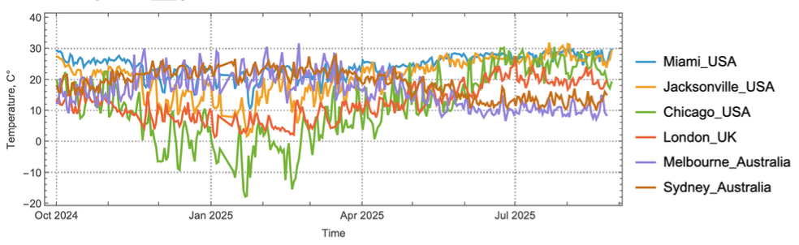
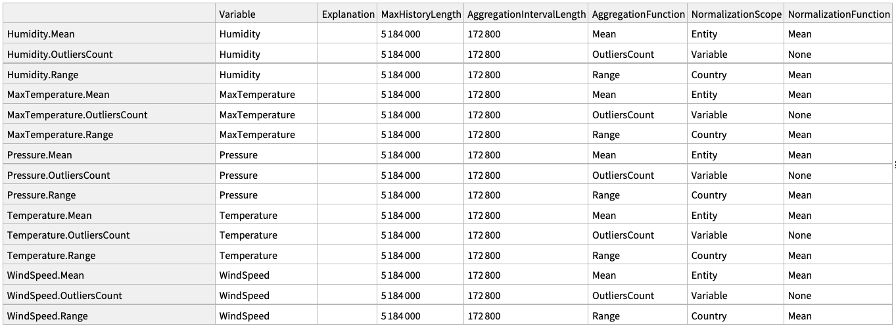
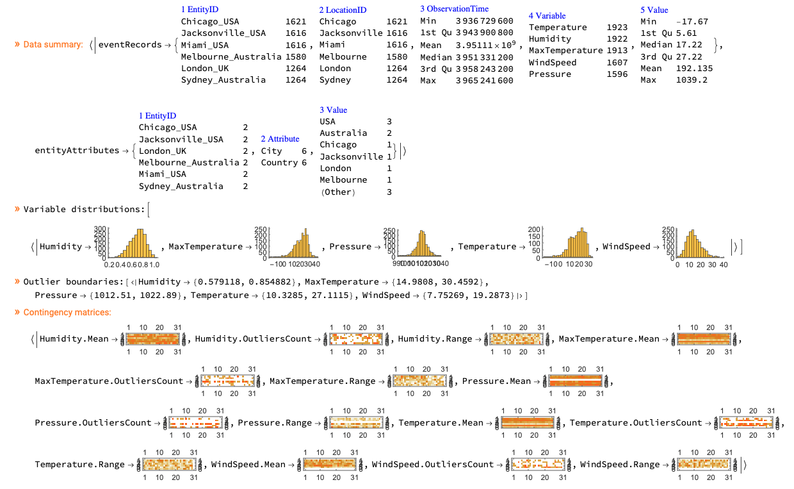

# WL-MonadicEventRecordsTransformations-paclet

## In brief

A software monad for transformation of event records with different variables and entities into (manageable) time series and sparse matrices.

### Details

<instructions>Details may include a long description of the resource's contents, history, methodology or other relevant information. Give references here if they are directly relevant to the resource. The details will appear above the examples on the webpage for the resource.</instructions>

* The primary goal of this Event Records Transformations Monad (ERTMon) is to convert hetergenous events data into sparse matrices (suitable for use in machine learning and statistical algorithms.)

* The produced sparse matrices are with named rows and columns -- see ["AntonAntonov/SSparseMatrix"](https://resources.wolframcloud.com/PacletRepository/resources/AntonAntonov/SSparseMatrix/).

* The monad takes a computational specification dataset.

* The event data records are grouped by entity identifier and variable.

* Groups corresponding to the same variable are used to make a sparse matrix corresponding to that variable.

* In the obtained variable sparse matrices each rows corresponds to an entitity identifier.

* The matrices are normalized according to the computational specification.

* A normalization can be "global" across all entities for a given variable, or "local", separately computed for each matrix row.

------

## Basic Examples

Prepare events data using weather data from meteorological stations close to certain major cities. The weather data is retrieved with paclet's function [WeatherEventRecords](paclet:AntonAntonov/MonadicEventRecordsTransformations/ref/WeatherEventRecords) from the paclet:

```mathematica
citiesSpec = {{"Miami", "USA"}, {"Jacksonville", "USA"}, {"Chicago", "USA"}, {"London", "UK"}, {"Melbourne", "Australia"}, {"Sydney", "Australia"}};
dateRange = {{2024, 10, 1}, {2025, 10, 1}};
wProps = {"Temperature", "MaxTemperature", "Pressure", "Humidity", "WindSpeed"};
res = WeatherEventRecords[citiesSpec, dateRange, wProps, 0];
```

Here we assign the obtained datasets to variables we use below:

```mathematica
eventRecords = res["eventRecords"];
entityAttributes = res["entityAttributes"];
```

Here are the summaries of the datasets eventRecords and entityAttributes :

```mathematica
ResourceFunction["RecordsSummary"][eventRecords]
ResourceFunction["RecordsSummary"][entityAttributes]
```

Here we take all temperature event records for those weather stations:

```mathematica
srecs = eventRecords[Select[#Variable == "Temperature"&]];
```

And here plot the corresponding time series obtained by grouping the records by station (entity ID's) and taking the columns "ObservationTime" and "Value":

```mathematica
grecs = Normal@GroupBy[srecs, #EntityID&][All, All, {"ObservationTime", "Value"}];
DateListPlot[grecs, ImageSize -> Large, PlotTheme -> "Detailed", AspectRatio -> 1/3, FrameLabel -> {"Time", "Temperature, C°"}]
```



Here is a computational specification:

```mathematica
compSpec = Dataset[Association["Humidity.Mean" -> Association["Variable" -> "Humidity", "Explanation" -> "", 
    "MaxHistoryLength" -> 5184000, "AggregationIntervalLength" -> 172800, 
    "AggregationFunction" -> "Mean", "NormalizationScope" -> "Entity", 
    "NormalizationFunction" -> "Mean"], "Humidity.OutliersCount" -> 
   Association["Variable" -> "Humidity", "Explanation" -> "", "MaxHistoryLength" -> 5184000, 
    "AggregationIntervalLength" -> 172800, "AggregationFunction" -> "OutliersCount", 
    "NormalizationScope" -> "Variable", "NormalizationFunction" -> "None"], 
  "Humidity.Range" -> Association["Variable" -> "Humidity", "Explanation" -> "", 
    "MaxHistoryLength" -> 5184000, "AggregationIntervalLength" -> 172800, 
    "AggregationFunction" -> "Range", "NormalizationScope" -> "Country", 
    "NormalizationFunction" -> "Mean"], "MaxTemperature.Mean" -> 
   Association["Variable" -> "MaxTemperature", "Explanation" -> "", "MaxHistoryLength" -> 5184000, 
    "AggregationIntervalLength" -> 172800, "AggregationFunction" -> "Mean", 
    "NormalizationScope" -> "Entity", "NormalizationFunction" -> "Mean"], 
  "MaxTemperature.OutliersCount" -> Association["Variable" -> "MaxTemperature", 
    "Explanation" -> "", "MaxHistoryLength" -> 5184000, "AggregationIntervalLength" -> 172800, 
    "AggregationFunction" -> "OutliersCount", "NormalizationScope" -> "Variable", 
    "NormalizationFunction" -> "None"], "MaxTemperature.Range" -> 
   Association["Variable" -> "MaxTemperature", "Explanation" -> "", "MaxHistoryLength" -> 5184000, 
    "AggregationIntervalLength" -> 172800, "AggregationFunction" -> "Range", 
    "NormalizationScope" -> "Country", "NormalizationFunction" -> "Mean"], 
  "Pressure.Mean" -> Association["Variable" -> "Pressure", "Explanation" -> "", 
    "MaxHistoryLength" -> 5184000, "AggregationIntervalLength" -> 172800, 
    "AggregationFunction" -> "Mean", "NormalizationScope" -> "Entity", 
    "NormalizationFunction" -> "Mean"], "Pressure.OutliersCount" -> 
   Association["Variable" -> "Pressure", "Explanation" -> "", "MaxHistoryLength" -> 5184000, 
    "AggregationIntervalLength" -> 172800, "AggregationFunction" -> "OutliersCount", 
    "NormalizationScope" -> "Variable", "NormalizationFunction" -> "None"], 
  "Pressure.Range" -> Association["Variable" -> "Pressure", "Explanation" -> "", 
    "MaxHistoryLength" -> 5184000, "AggregationIntervalLength" -> 172800, 
    "AggregationFunction" -> "Range", "NormalizationScope" -> "Country", 
    "NormalizationFunction" -> "Mean"], "Temperature.Mean" -> 
   Association["Variable" -> "Temperature", "Explanation" -> "", "MaxHistoryLength" -> 5184000, 
    "AggregationIntervalLength" -> 172800, "AggregationFunction" -> "Mean", 
    "NormalizationScope" -> "Entity", "NormalizationFunction" -> "Mean"], 
  "Temperature.OutliersCount" -> Association["Variable" -> "Temperature", "Explanation" -> "", 
    "MaxHistoryLength" -> 5184000, "AggregationIntervalLength" -> 172800, 
    "AggregationFunction" -> "OutliersCount", "NormalizationScope" -> "Variable", 
    "NormalizationFunction" -> "None"], "Temperature.Range" -> 
   Association["Variable" -> "Temperature", "Explanation" -> "", "MaxHistoryLength" -> 5184000, 
    "AggregationIntervalLength" -> 172800, "AggregationFunction" -> "Range", 
    "NormalizationScope" -> "Country", "NormalizationFunction" -> "Mean"], 
  "WindSpeed.Mean" -> Association["Variable" -> "WindSpeed", "Explanation" -> "", 
    "MaxHistoryLength" -> 5184000, "AggregationIntervalLength" -> 172800, 
    "AggregationFunction" -> "Mean", "NormalizationScope" -> "Entity", 
    "NormalizationFunction" -> "Mean"], "WindSpeed.OutliersCount" -> 
   Association["Variable" -> "WindSpeed", "Explanation" -> "", "MaxHistoryLength" -> 5184000, 
    "AggregationIntervalLength" -> 172800, "AggregationFunction" -> "OutliersCount", 
    "NormalizationScope" -> "Variable", "NormalizationFunction" -> "None"], 
  "WindSpeed.Range" -> Association["Variable" -> "WindSpeed", "Explanation" -> "", 
    "MaxHistoryLength" -> 5184000, "AggregationIntervalLength" -> 172800, 
    "AggregationFunction" -> "Range", "NormalizationScope" -> "Country", 
    "NormalizationFunction" -> "Mean"]]];
```




Here is a monad pipeline that process the event records into sparse matrices:

```mathematica
p2 = 
	ERTMonUnit[]\[DoubleLongRightArrow]
	ERTMonSetEventRecords[eventRecords]\[DoubleLongRightArrow]
	ERTMonSetEntityAttributes[entityAttributes]\[DoubleLongRightArrow]
	ERTMonEchoDataSummary\[DoubleLongRightArrow]
	ERTMonSetComputationSpecification[compSpec]\[DoubleLongRightArrow]
	ERTMonGroupEntityVariableRecords\[DoubleLongRightArrow]
	ERTMonComputeVariableStatistic[Histogram]\[DoubleLongRightArrow]
	ERTMonEchoFunctionValue["Variable distributions:"]\[DoubleLongRightArrow]
	ERTMonFindVariableOutlierBoundaries\[DoubleLongRightArrow]
	ERTMonEchoFunctionValue["Outlier boundaries:"]\[DoubleLongRightArrow]
	ERTMonEntityVariableGroupsToTimeSeries["MaxTime"]\[DoubleLongRightArrow]
	ERTMonAggregateTimeSeries\[DoubleLongRightArrow]
	ERTMonMakeContingencyMatrices\[DoubleLongRightArrow]
	ERTMonEchoFunctionValue["Contingency matrices:", MatrixPlot /@ #&];
```



----


## References

### Paclets

[AAp1] Anton Antonov, [DataReshapers](https://resources.wolframcloud.com/PacletRepository/resources/AntonAntonov/DataReshapers/), (2023), [Wolfram Language Paclet Repository](https://resources.wolframcloud.com/PacletRepository/).

[AAp2] Anton Antonov, [MonadMakers](https://resources.wolframcloud.com/PacletRepository/resources/AntonAntonov/MonadMakers/), (2023), [Wolfram Language Paclet Repository](https://resources.wolframcloud.com/PacletRepository/).

[AAp3] Anton Antonov, [OutlierIdentifiers](https://resources.wolframcloud.com/PacletRepository/resources/AntonAntonov/OutlierIdentifiers/), (2023), [Wolfram Language Paclet Repository](https://resources.wolframcloud.com/PacletRepository/).

[AAp4] Anton Antonov, [SSparseMatrix](https://resources.wolframcloud.com/PacletRepository/resources/AntonAntonov/SSparseMatrix/), (2023), [Wolfram Language Paclet Repository](https://resources.wolframcloud.com/PacletRepository/).

### Documents

[AA1] Anton Antonov, ["Monad code generation and extension"](https://mathematicaforprediction.wordpress.com/2017/06/23/monad-code-generation-and-extension/)*, (2017), *[*MathematicaForPrediction at WordPress*](https://mathematicaforprediction.wordpress.com).

[AA2] Anton Antonov, ["A monad for classification workflows"](https://mathematicaforprediction.wordpress.com/2018/05/15/a-monad-for-classification-workflows/), (2018), [MathematicaForPrediction at WordPress](https://mathematicaforprediction.wordpress.com).

